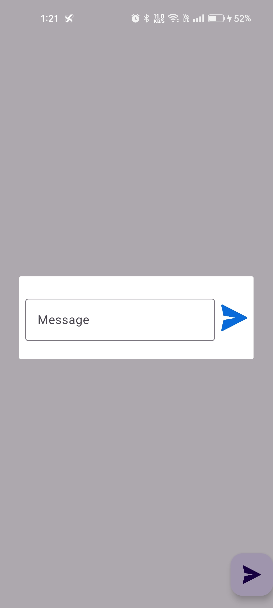
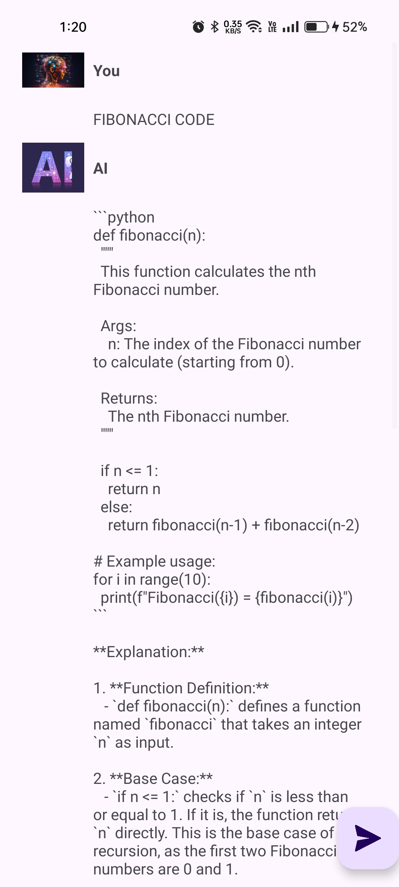

# GemChat - AI-Powered Chat Application

**GemChat** is an AI-powered chat application that leverages the **Gemini API** to enable intelligent conversations between users and AI. The app allows users to send messages, receive AI-generated responses, and maintain a smooth chat experience. The backend is integrated using **Retrofit** for API communication.

## Features

- **Gemini AI-Powered Conversations**: Utilizes the Gemini API to generate dynamic, real-time AI responses.
- **Clean User Interface**: Provides a seamless and modern chat experience.
- **Message History**: Keeps a running chat history that users can scroll through easily.
- **Floating Action Button for Message Sending**: Users can send their queries to the AI with the help of an intuitive floating action button.
- **Progress Bar**: Displays a loading progress indicator while the AI processes and responds to the user's message.

## Screenshots

<p align="center">
    
    
    
</p>

## Tech Stack

- **Programming Language**: Java
- **AI Integration**: Gemini API for AI-powered chat functionalities.
- **Networking**: Retrofit for API communication and Gson for JSON parsing.

## Requirements

- **Gemini API Key**: You will need a valid API key from the Gemini platform to access AI functionalities. Make sure to include this key in your application configuration.

## Setup and Installation

### Prerequisites

- **Android Studio**: Ensure that the latest version of Android Studio is installed.
- **Java 8+**: The project is built with Java 1.8 compatibility.
- **Gradle**: Android Gradle Plugin 7.0+ is required.

### Steps to Run the Project

1. **Clone the repository**:
   ```bash
   git clone https://github.com/Arnavjain2503/gemchat.git
   cd gemchat
   ```

2. **Open the project in Android Studio**.

3. **Sync Gradle**:
   - The project uses **Gradle** for managing dependencies.
   - Sync your Gradle files to install all required libraries.

4. **Build the Project**:
   - Go to the **Build** menu in Android Studio and click **Rebuild Project**.

5. **Run the App**:
   - Connect an Android device or use an emulator and press **Run**.

### Dependencies

- **Gemini API**: For AI-generated responses.
   ```gradle
   implementation("com.google.ai.client.generativeai:generativeai:0.7.0")
   implementation("com.google.ai.client.generativeai:generativeai-gson:0.7.0")
   implementation("com.google.ai.client.generativeai:generativeai-retrofit:0.7.0")
   ```
- **Retrofit & Gson**: For handling network requests and parsing responses.
   ```gradle
   implementation ("com.squareup.retrofit2:retrofit:2.9.0")
   implementation ("com.squareup.retrofit2:converter-gson:2.5.0")
   ```

## Key Files

- **MainActivity.java**: This is the main activity of the app that handles user interactions and manages the chat interface.
- **activity_main.xml**: The layout file that defines the chat interface, including the `ProgressBar`, `ScrollView`, and `FloatingActionButton`.
- **Gemini API Integration**: The app communicates with the **Gemini AI** using a RESTful API to fetch AI responses.
- **Retrofit Client**: This client handles HTTP requests to the Gemini API for message exchange between the user and the AI.

## Usage

1. **Launch the App**: Open the app to start interacting with the AI.
2. **Send a Message**: Type your message in the input field and press the **send** button to send it to the AI.
3. **Receive AI Response**: The Gemini AI will process your query and return a dynamic response, which will be displayed in the chat.

## License

This project is licensed under the MIT License - see the [LICENSE](LICENSE) file for details.

## Author

**Arnav Jain**  